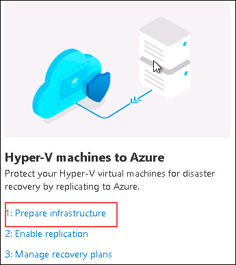
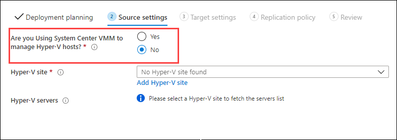
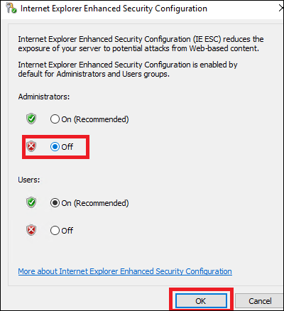
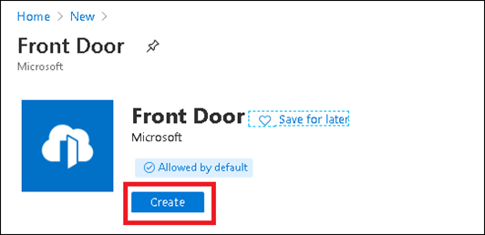
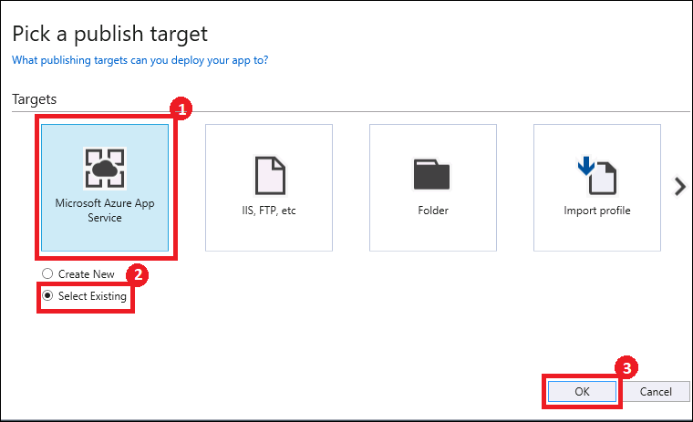

## Exercise 3: Configure environments for failover

Duration: 90 minutes

In this exercise, you will configure the three environments to use BCDR technologies found in Azure. Each environment has unique configurations that must be completed to ensure their availability in the event of a disaster.

> **Note**: Make sure prior to starting each task that the deployment that you started in Exercise 1 has completed for each as you come to that task. This can be determined by reviewing the deployments for each Resource group in the Azure portal. If it says Succeeded, then you can begin the task.

### Task 1: Configure on-premises to Azure IaaS failover

In this task, the **OnPremVM** will be configured to replicate to Azure and be ready to failover to the **BCDRIaaSSecondarySite**. This will consist of configuring your Hyper-V host with the ASR provider and then enabling replication of the VM to the Recovery Service Vault.

1. From the Azure portal, open the **BCDRRSV** Recovery Services Vault located in the **BCDRAzureSiteRecovery** resource group.

2. Select **Site Recovery** in the **Getting Started** area of **BCDRRSV** blade.

    

3. In the **Hyper-V machines to Azure** section, select **1. Prepare infrastructure**.. This will start you down a path of various steps to configure your VM that is running on Hyper-V on-premises to be replicated to Azure.

    

4. On **Step 1 Deployment planning**, confirm you have completed deployment planning by selecting **Yes, I have done it** then select **Next**.

    > **Note**: You can read more about planning an ASR to deployment here:
    >
    > <https://docs.microsoft.com/en-us/azure/site-recovery/site-recovery-hyper-v-deployment-planner>

    
    
5. On the **Source settings** tab of the **Prepare infrastructure** blade, next to the **Are you Using System Center VMM to manage Hyper-V hosts** label, select the **No** option.

    

6. On the **Source settings** tab of the **Prepare infrastructure** blade, select the **Add Hyper-V site** link.

    

7. On the **Create Hyper-V site** blade, enter the name: `OnPremHyperVSite`. Select **OK**.

    

8. The portal will deploy the site providing you notifications. Wait for the creation process to complete, and the ASR portal will update once this is done.

    

    

9. Next select **Add Hyper-V Server**.

    

10. A new blade will appear. You will need to download the vault registration key to register the host in the Hyper-V site of ASR. Select the Download button which will save the file to your Downloads folder on the **LABVM**.

    

11. Open a **NEW** tab in your web browser and connect again to the Azure Portal at <https://portal.azure.com>.

12. Select **Resource groups**, then **BCDROnPremPrimarySite**.

    

13. Locate and select the **HYPERVHOST** VM object.

    

14. Select **Connect** and open the RDP file that is downloaded.

    

15. Enter the credentials for the VM:

    - **Username**: 'mcwadmin'
    - **Password**: 'demo@pass123'

16. You will be prompted with a warning about a certificate. Select **Yes** to connection (you can always select yes to these prompts during this HOL).

    

17. Select **Yes** on the Networks prompt.

    

18. On the **HYPERVHOST** select **Configure this local server** in the Server Manager Dashboard.

    

19. On the right side of the pane, select **On** by **IE Enhanced Security Configuration**.

    

20. Change to **Off** for Administrators and select **OK**.
  
    

21. Open Internet Explorer on **HYPERVHOST** and browse to the following URL. This will download the Azure Site Recovery Provider for Hyper-V.

    ```text
    http://aka.ms/downloaddra_cus
    ```

22. Select **Run**.

    

23. Select **On** and then **Next**.

    

24. Select **Install** on the Provider Installation screen.

    

25. Once the Provider has been installed you will come to a screen that will request for you **Register** or **Finish**. Select **Register**.

    

26. Minimize your Remote Desktop window and locate the vault registration key which is in the **Downloads** directory of **LABVM**. Right-click the file and copy it. Move back to **HYPERVHOST** and paste the file to the desktop.

    

    

27. On the Vault Setting screen select **Browse**.

    

28. Locate the Vault file on the desktop and select **Open**.

    

29. The Vault Settings will now be populated. Select **Next**.

    

30. On the Proxy settings screen retain the settings **Connect directly to Azure Site Recovery without a proxy server** and select **Next**.

    

31. The provider will then connect and configure the Azure Site Recovery registration for the Hyper-V Server.

    

32. After a few minutes, the wizard will be complete with the message **The Server was registered in the Azure Site Recovery vault.** Select **Finish** to close the Provider installation.

    

33. Select **Start**, **Windows Administrative Tools**.

    

34. Locate then double-click the **Hyper-V Manager**.

    

35. When the Hyper-V Manager opens, select the Server name in the left pane and then you will see that the **OnPremVM** virtual machine is running on your **HYPERVHOST**. This is an Ubuntu 16.04.3 LTS server running Apache, PHP and MySQL. Double-click on the VM to open.

    

36. The console for the **OnPremVM** will load. Press **Enter** to get a login prompt.

    

37. Login to the VM using the following credentials:

    - **Username**: `mcwadmin`
    - **Password**: `demo@pass123`

38. Once logged in enter a few commands and notice that you can get to the internet and that the **local IP address of the VM is currently 192.168.0.10**.

    ```dos
    ping 8.8.8.8 -c 4

    ifconfig
    ```

    

39. Open Internet Explorer on **HYPERVHOST** and browse to the following URL of the **OnPremVM**. This is very simple PHP application running on the **OnPremVM** connected to the MySQL Server that is running locally on the VM. This is to simulate an application is that running on one VM in the on-premises data center.

    ```text
    http://192.168.0.10/bcdr.php
    ```

    

40. From the command prompt of the OnPremVM, update the OS with the latest patches by using the following command. You will need to enter the password again.

    ```bash
    sudo apt-get update -y
    ```

    

41. After the updates complete, install the Azure Guest Agent for Linux on the VM using the following commands:

    ```bash
    sudo apt-get install walinuxagent -y
    ```

    

    > **Note**: You may see some errors and warnings including some related to "cloud-init" and new updates being available. This is normal behavior since this VM thinks it should be in Azure. This may take 5-10 minutes.

42. Once you're returned to the command prompt, type **exit** into the terminal and hit **Enter** to log out of **OnPremVM**.

43. Sign out of **HYPERVHOST** and return to the Azure portal running on your **LABVM**.

44. You will need to return to the Prepare Source screen and select **+Hyper-V Server**. Notice the warning that it could take up to 30 mins for this server to appear, but in practice you should cancel out of this window by selecting Step 2 and then answer yes again with **I have done it** to the question of Deployment planning.

    

45. Once the Server appears, select **OK**.

    

46. On **Step 4 Target Prepare** review the screen to better understand the various steps. Select **+Storage account** to add a storage account that will be used for the **OnPremVM** when it is failed over to Azure.

    

47. Select **Create New** and provide a unique name for your storage account containing the name of the VM **OnPremVM** with added characters to make it unique. Also, select the Premium tier for the storage account and select **OK**.

    

    > **Note:** Be sure to select **Premium** Performance or you may run into issues later in the lab.

48. Select **+Storage account** again and create a second storage account using the **Standard** performance tier, then select **OK**.

49. The portal will submit a deployment, and you must wait until this completes. It will be created in the **BCDRAzureSiteRecovery** resource group.
  
    

50. You will be failing the **OnPremVM** into the **Secondary** site that was deployed with your IaaS installation, so you already have a Virtual Network created. Select **OK** on the Target blade to continue.

    

51. On the **Replication Policy** screen, select the **+Create and Associate** item.

    

52. Enter the name: `OnPremVM-POL`. Review the settings that you can configure and then select **OK**.

    

53. Azure will run a deployment and start the process of creating and then associating the Hyper-V Site with the replication policy.

    

    

    > **Note**: This will take a couple of minutes to complete. Please wait until this completes prior to moving on.

    Once complete, select **OK**.

    

54. Select **OK** again, and the process for adding the Hyper-V Server to the Recovery Services Vault will be complete.

    

55. Next, select Step 1: **Replicate Application**.

    

56. On the Source blade select: **Source**: **On-premises**, **Are you performing a migration**: **No**, and **Source location**: **OnPremHyperVSite** and select **OK**.

    

57. Complete the Target blade, select the following values:

    - **Post-failover resource group**: BCDRIaaSSecondarySite
    - **Storage Account**: Select the account you just created (**onpremvm8675309**).
    - **Storage Account for replication logs**: Create a *new* one using the prefix **bcdrasrrepllogs**.
    - **Azure network**: Configure now for selected machines.
    - **Post-failover Azure network**: BCDRFOVNET
    - **Subnet**: WEB (172.16.1.0/24)

    

58. Next on the **Select virtual machines** select **OnPremVM** and then select **OK**.

    

59. Complete the **OnPremVM** selections of the **Configure properties** blade using these inputs and then select **OK**:

    - **OS Type**: Linux
    - **OS Disk**: OnPremLinuxVM
    - **Disks to Replicate**: OnPremLinuxVM \[127.00GB\]

    

60. On the **Configure replication settings** blade review the selections and notice that the **OnPremVM-POL** that you created has been selected. Select **OK**.

    

61. On the final screen, select **Enable replication**.

    

62. The deployment will be submitted. You can select **Site Recovery Jobs** to review the process.

    

63. After a few minutes, the Enable replication will move to Successful. Select **Overview** and **Site Recovery** on the **BCDRRSV** blade. You should now see that there is one (1) Healthy Replicated Item.

    

64. Select **Healthy 1** and you will see the replicated items list. Notice it shows that the VM is healthy, but the replication has just started, so it shows **0% synchronized**. It will take a few minutes for the VM to replicate.

    

    > **Note**: If the **OnPremVM** does not immediately go to a healthy replication  state, or ever gets in an unhealthy state, you may need to "Disable Replication" and recreate it using the steps above.

65. Select **OnPremVM**. Review the Replication details for **OnPremVM**. Once the VM has replicated, the selections across the top menu bar of the dashboard will allow you to work with this VM.

    

    > **Note**: It will take about 15 minutes for the VM to replicate, so you can move on and come back to review the environment later.

66. Scroll down and review the Infrastructure view of the BCDR environment you have created for **OnPremVM**. You can select **Hyper-V Virtual Machine** to review what is protected.

    

    

67. Next, select **Compute and Network**.

    

68. Details of the VM will be shown, and you can make configuration changes. Change the **Size** of the VM to **DS2\_v2,** and then select **Save**.

    

> **Note**: It could take a few minutes for these screens to populate, so be patient. You can come back to this step later to adjust the size if you wish.

### Task 2: Configure IaaS SQL Always On availability groups for region to region failover

In this task, you will build a Windows Failover Cluster and configure SQL Always On Availability Groups. This will be in place to ensure that if there is an issue in the **Primary** site in Azure you can failover to the **Secondary** site and have access to the data for the application. You will also configure Front Door to ensure that the Web Application will always answer to the same DNS name even when it is failed over to the **Secondary** site.

1. From the **LABVM** navigate to the Azure Portal, and navigate to **Resource Groups** and then **BCDRAzureSiteRecovery**.

    

2. Select **+Add**.

    

3. In the Search box, enter **Storage Account,** and then select **Storage account -- blob, file, table, queue**.

    

4. Select **Create**.

    

5. Complete the **Create storage account** form using the following details, then select **Review + create**:

    - **Resource group**: Use existing / BCDRAzureSiteRecovery.
    - **Storage account name:** Unique name starting with `bcdrcloudwitness`
    - **Deployment model**: Resource manager
    - **Account kind**: Storage (general purpose v2)
    - **Performance**: Standard
    - **Replication**: Locally-redundant storage (LRS)
    - **Location**: Any location in your area that is **NOT** your Primary or Secondary site.

    

6. Once the storage account is created, locate and select **Access keys** under **Settings**.

    

7. Copy the name of the account and the first access key to notepad and save the file as `C:\HOL\Deployments\CloudWitness.txt` on your **LABVM**.

    

    

8. From the **LABVM**, connect to the Azure portal and locate the **BCDRIaaSPrimarySite** Resource group.

    

9. Select **BCDRDC1** and then select **Connect**. Choose Download RDP File, then open the downloaded file and login using the following credentials:

    - **Username**: `mcwadmin`
    - **Password**: `demo@pass123`

   

10. Once in the RDP session to **BCDRDC1**, select **Start** and then **Remote Desktop**. You will need to connect to **SQLVM1** for the next steps.

    

11. Connect to **SQLVM1** using the following credentials:

    - **Username**: `CONTOSO\mcwadmin`
    - **Password**: `demo@pass123`

    

12. Minimize your Remote Desktop window and locate three files: **ClusterCreateSQLVM1.ps1**, **ClusterUpdateSQLVM1.ps1** and **CloudWitness.txt** in the `C:\HOL\Deployments` directory of your **LABVM**. Right-click the files and copy them, then move back to your **SQLVM1** and **paste the files to the desktop**.

    

13. On **SQLVM1**, select Start and then select **PowerShell ISE**.

    

14. Open the **ClusterCreateSQLVM1.ps1** in the PowerShell ISE window. Then select the **green play button**. This script will create the Windows Failover Cluster and add all the SQL VMs as nodes in the cluster. It will also assign a static IP address of 10.0.2.99 to the new Cluster named **AOGCLUSTER**.

    

    

    >**Note:** If you get a `The term 'New-Cluster' is not recognized` error, then run the following command to install the Failover Clusters feature and try again:
    > ```PowerShell
    > Add-WindowsFeature RSAT-Clustering-PowerShell
    > ```

    >**Note:** It is possible to use a wizard for this task, but the resulting cluster will require additional configuration to set the static IP address in Azure.

15. After the cluster has been created, select **Start** and then **Windows Administrative Tools**. Locate and open the **Failover Cluster Manager**.

    

16. When the cluster opens, select **Nodes** and the SQL Server VMs will show as nodes of the cluster and show their status as **Up**.

    

17. If you select **Roles**, you will notice that currently, there aren't any roles assigned to the cluster.

    

18. Select Networks, and you will see two networks: **Cluster Network 1** and **Cluster Network 2**. Both should show the status of **Up**. If you navigate through to the networks, you will see their IP address spaces, and on the lower tab you can select **Network Connections** and review the nodes.

    

    

19. Right-click **AOGCLUSTER,** then select **More Actions**, **Configure Cluster Quorum Settings**.

    

20. On the **Configure Cluster Quorum Wizard** select **Next**, then choose **Select the quorum witness**. Then, select **Next** again.

    

21. Select **Configure a cloud witness** and **Next**.

    

22. Open the **CloudWitness.txt** file on the desktop of **SQLVM1** and copy the **Storage account name** and **KEY1** values and paste them into their respective fields on the form. Leave the Azure Service endpoint as configured. Then, select **Next**.

    

23. Select **Next** on the Confirmation screen.

    

24. Select **Finish**.

    

25. Select the name of the Cluster again and the **Cloud Witness** should now appear in the **Cluster Resources**. It's important to always use a third data center, in your case here a third Azure Region to be your Cloud Witness.

    

26. Select **Start** and Launch **SQL Server 2017 Configuration Manager**.

    

27. Select **SQL Server Services**, then right-click **SQL Server (MSSQLSERVER)** and select **Properties**.

    

28. Select the **AlwaysOn High Availability** tab and check the box for **Enable AlwaysOn Availability Groups**. Select **Apply** and then select **OK** on the message that notifies you that changes won't take effect until after the server is restarted.

    

    

29. On the **Log On** tab, change the service account to `contoso\mcwadmin` with the password `demo@pass123`. Select **OK** to accept the changes, and then select **Yes** to confirm the restart of the server.

    

    

30. Open a new Remote desktop session (this can be done from within SQLVM1), and repeat these steps to **Enable SQL Always On**. Change the username to `contoso\mcwadmin` on each of the other nodes **SQLVM2**, and **SQLVM3.** Make sure that you have restarted the SQL Service on each node prior to moving to the next node.

    > **Note**: If you get confused what server you are on open a command prompt and simply enter the command *hostname*.

31. After you have completed the process on each SQLVM Node, reconnect to **SQLVM1** using Remote Desktop.

    > **Note**: Remember that you must use the **BCDRDC1** VM as your jumpbox to get into the environment. You can use the Azure portal to connect to **BCDRDC1** and then use Remote desktop from there to **SQLVM1**.

32. Use the Start menu to launch **Microsoft SQL Server Management Studio 17** and connect to the local instance of SQL Server. (Located in the Microsoft SQL Server Tools folder).

    

33. Select **Connect** to sign on to **SQLVM1**.

    

34. Right-click **Always On High Availability**, then select **New Availability Group Wizard**.

    

35. Select **Next** on the Wizard.

    

36. Provide the name **BCDRAOG** for the **Availability group name**, then select **Next**.

    

37. Select the **ContosoInsurance Database**, then select **Next**.

    

38. On the **Specify Replicas** screen next to **SQLVM1**, select **Automatic Failover**.

    

39. Select **Add Replica**.

    

40. On the **Connect to Server** dialog box enter the Server Name of **SQLVM2** and select **Connect**.

    

41. For **SQLVM2**, select Automatic Failover and Availability Mode of Synchronous commit.

    

42. Select **Add Replica**.

    

43. On the **Connect to Server** dialog box enter Server Name of **SQLVM3** and select **Connect**.

    

44. At this point, the wizard should resemble the following:

    

45. Select **Endpoints** and review these that the wizard has created.

    

46. Next, select **Listener**. Then, select the **Create an availability group listener**.

    

47. Add the following details:

    - **Listener DNS Name**: BCDRAOG
    - **Port**: 1433
    - **Network Mode**: Static IP

    

48. Next, select **Add**.

    

49. Select the Subnet of **10.0.2.0/24** and then add IPv4 **10.0.2.100** and select **OK**. This is the IP address of the Internal Load Balancer that is in front of the **SQLVM1** and **SQLVM2** in the **BCDRVNET** **Data** Subnet running in the **Primary** Site.

    

50. Select **Add**.

    

51. Select the Subnet of **172.16.2.0/24** and then add IPv4 **172.16.2.100** and select **OK**. This is the IP address of the Internal Load Balancer that is in front of the **SQLVM3** in the **BCDRFOVNET** **Data** Subnet running in the **Secondary** Site.

    

52. Select **Next**.

    

53. On the **Select Initial Data Synchronization** screen, make sure that **Automatic seeding** is selected and select **Next**.

    

54. On the **Validation** screen, you should see all green. Select **Next**.

    

55. On the Summary page select **Finish**.

    

56. The wizard will configure the AOG.

    

57. Once the AOG is built, select **Close**.

    

58. Move back to **SQL Management Studio** on **SQLVM1** and expand the **Always On High Availability** item in the tree view. Under Availability Groups, expand the **BCDRAOG (Primary)** item.

    

59. Right-click **BCDRAOG (Primary)** and then select **Show Dashboard.** You should see that all the nodes have been added and are now "Green".

    

    

60. Next, select **Connect** and then **Database Engine** in SQL Management Studio.

    

61. Enter **BCDRAOG** as the Server Name. This will be connected to the listener of the group that you created.

    

62. Once connected to the **BCDRAOG**, you can select **Databases** and will be able to see the database there. Notice that you have no knowledge directly of which server this is running on.

    

63. Move back to PowerShell ISE on **SQLVM1** and open the PowerShell script named **ClusterUpdateSQLVM1.ps1**. Select the **Play** button. This will update the Failover cluster with the IP Addresses of the Listener that you created for the AOG.

    

    

64. Move back to SQL Management Studio and select **Connect** and then **Database Engine**.

    

65. This time, put the following into the IP address of the Internal Load balancer of the **Primary** Site AOG Load Balancer: **10.0.2.100**. You again will be able to connect to the server which is up and running as the master.

    

66. Once connected to **10.0.2.100**, you can select **Databases** and will be able to see the database there. Notice that you have no knowledge directly of which server this is running on.

    

    > **Note:** It could take a minute to connect the first time as this is going through the Azure Internal Load Balancer.

67. Move back to Failover Cluster Manager on **SQLVM1**, and you can review the IP Addresses that were added by selecting Roles and **BCDRAOG** and viewing the Resources. Notice how the **10.0.2.100** is Online since the current primary replica is on the **Primary** Site.

    

68. Now that the AOG is up and running online the Contoso Insurance Web Application should be available. Minimize the RDP window and from the **LABVM** open the Azure portal and navigate to the resource group **BCDRIaaSPrimarySite**. Select **WWWEXTLB-PIP** which is the Public IP address for the external load balancer **WWWEXTLB** in front of **WEBVM1** and **WEBVM2** in your Primary region.

    

69. Locate the DNS name address and copy it to your clipboard.

    

70. Open a new tab in the browser and navigate to the DNS name. The **Contoso Insurance PolicyConnect** application should load in your browser. Select the **Current Policy Offerings** button to check for database connectivity.

    

71. If you can see the offerings, then the application is able to access the database. You can also go back to the home page and interact with the application including adding, editing or deleting data.

    

    > **Note**: If you see the following screen shot then something is not configured correctly with your environment. The connection string of the application is configured to use the name of **bcdraog.contoso.com** which is the name for the SQL AOG listener. This configuration is part of the connection string located in the **web.config** file which is on **WEBVM1** and **WEBVM2** in the `C:\Inetpub\wwwroot` directory. If you for some reason you named something incorrectly you can make a change to this file and then `iisreset /restart` from the command line on the WEBVMs.
    >
    > 

72. Once you have verified that the application is up and running, you will need to build a Front Door to direct traffic to the edge of your Primary and Secondary Site. Select **+Create a resource**, then search for and select **Front Door** within the Azure Portal.

    
    
    

73. Complete the **Basics** tab of the **Create a Front Door** blade using the following inputs, then select **Next: Configuration >**:

    - **Resource group**: Use existing / **BCDRIaasPrimarySite**
    - **Location**: Automatically assigned based on the region of **BCDRIaaSPrimarySite**.

    

74. Select the **plus** icon on the **Frontend hosts** box to set the host name of Front Door.

    

75. In the **Add a frontend host** pane, enter the following values, then select **Add**:

    - **Host name**: Enter a unique name with the prefix of `bcdriaas`
    - **Session affinity**: Disabled

    

76. Select the **plus** button on the **Backend pools** box to begin adding endpoints to the backend pool.

    

77. On the **Add a backend pool** pane, enter the following value, then select the **Add a backend** link.

    - **Name**: `BCDRIaaSPrimarySiteLB`
    - **Health Probes - Protocol**: HTTP

    

78. On the **Add a backend** pane, enter the following values, then select **Add**:

    - **Backend host type**: Custom host
    - **Backend host name**: Paste in the DNS name for the Public IP Address (named **WWWEXTLB-PIP**) associated with the Load Balancer for the Web VMs within the **BCDRIaaSPrimarySite** resource group.

    

79. Select **Add a backend** again and add another backend host to the pool. Create it similar to before, but with the following settings:

    - **Backend host type**: Custom host
    - **Backend host name**: Paste in the DNS name for the Public IP Address (named **WWWEXTLB-PIP**) associated with the Load Balancer for the Web VMs within the **BCDRIaaSSecondarySite** resource group.
    - **Priority**: 2

    

80. Select **Add** to create the backend pool.

81. Select the **plus** button on the **Routing rules** box.

    

82. On the **Add a rule** pane, enter the following values, then select **Add**.

    - **Name**: `BCDRIaaS`
    - **Accepted protocol**: HTTP only
    - **Backend pool**: BCDRIaaSPrimarySiteLB
    - **Forwarding protocol**: HTTP Only

    

83. Select **Review + Create**.

    

84. Once validation has completed, select **Create** to provision the Front Door service.

85. Select the **Frontend host** URL of Azure Front Door, the Policy Connect web application will load. This is connecting to the **WWWEXTLB** External Load Balancer that is in front of **WEBVM1** and **WEBVM2** running in the **Primary** Site in **BCDRIaaSPrimarySite** resource group and connecting to the SQL Always On Listener at the same location.

    

    

    > **Note:** Be sure to use **HTTP** to access the Azure Front Door **frontend host** URL. The lab configurations only supports HTTP for Front Door since WebVM1 and WebVM2 for the BCDRIaaS environment are only setup for HTTP support; not HTTPS (no SSL\TLS).

    > **Note:** If you get a "Our services aren't available right now" error (or a 404 type error) accessing the web application, then continue on with the lab and come back to this later. Sometime this can take a ~10 minutes for the routing rules to publish before it's "live".
    >
    > 

### Task 3: Configure IaaS for region to region failover

In this task the WEBVM1 and WEBVM2 will be configured to replicate from the Primary Site to the Secondary site to support an Azure region to region failover. This will consist of configuring the VMs to replicate and integrating with the Azure Automation to failover the SQL Always On group from the Primary Site to the Secondary. Once the failover is complete the website will again answer to the Front Door hostname.

1. From the Azure portal on **LABVM**, open the **BCDRRSV** Recovery Services Vault located in the **BCDRAzureSiteRecovery** resource group.

2. Select **Site Recovery** in the **Getting Started** area of **BCDRRSV** blade.

    

3. Next, select **Step 1: Replicate Application** in the **For On-Premises Machines and Azure VMs** section. This will start you down a path of various steps to configure your WEBVMs that are running on Azure at your Primary Site.

    

4. On **Step 1 Source** select the following inputs and then select **OK**:

    - **Source**: Azure
    - **Source Location**: East US 2 (*Your* Primary Region)
    - **Azure virtual machine deployment model**: Resource Manager
    - **Source resource group**: BCDRIaaSPrimarySite

    

5. On **Step 2 Virtual Machines**, select **WEBVM1** and **WEBVM2** and then select **OK**.

    

6. On the **Configure settings** blade, select the **Target location** as **Central US** (your Secondary Site Azure Region).

    

7. Select **Customize**.

    

8. Update the rest of the blade using the following inputs and the select **OK**:

    - **Target resource group**: BCDRIaaSSecondarySite
    - **Target virtual network**: BCDRFOVNET
    - **Replica Managed Disk:** Accept the new account.
    - **Cache Storage:** Accept the new account.
    - **Target Availability Type:**
      - **WEBVM1**: **zone 1**
      - **WEBVM2**: **zone 2**

    

    > **Note**: Double check these selections, they are **critical** to your on-premise to Azure failover!

    

9. Next, select **Create target resources**.

    

10. Then select **Enable replication**.

    

11. The Azure portal will start the deployment. This will take approximately 10 minutes to complete. You will receive a notification once it has deployed.

    ")

12. Return to the Recovery Services Vault **BCDRRSV** and you will now see that three (3) items are being replicated.

    

    

13. Select the **Replicated Items** link under **Protected Items**.

    

14. You should see three items: **OnPremVM**, **WEBVM1** and **WEBVM2**. The **OnPremVM** will show as protected and the others may still need to synchronize a bit more.

    

15. Once **WEBVM1** and **WEBVM2** have reached Protected status, you can move on to the next step.

    

    > **Note**: It can take up to 30 minutes for this action to complete.

16. Under the **Manage** area select **Recovery Plans (Site Recovery)**.

    

17. Select **+Recovery plan**.

    

18. On the **Create recovery plan** blade, provide the Name: **BCDRIaaSPlan** and Source: select your **Primary** site.

    

19. Complete the rest of the blade using the following inputs and then select **OK**:

    - **Target**: Secondary region
    - **Allow items with deployment model**: Resource Manager
    - **Select Items**: Select **WEBVM1** and **WEBVM2**

    

20. After a moment, the **BCDRIaaSPlan** Recovery plan will appear, select it to review.

    

21. When the **BCDRIaaSPlan** loads **notice** that it shows **2 VMs in the Source** which is your **Primary** Site. Then select **Customize**.

    

22. Once the **BCDRIaaSPlan** blade loads, select the **ellipse** next to **All groups failover**.

    

23. Select **Add pre-action**.

    

24. On the **Insert action** blade, select **Script** and then provide the name: `ASRSQLFailover`. Ensure that your Azure Automation account is selected and then chose the Runbook name: **ASRSQLFailover**. Select **OK**.

    

25. Once the **BCDRIaaSPlan** blade loads, select the **ellipse** next to **Group 1: Start**.

    

26. Select **Add post action**.

    

27. On the **Insert action** blade, select **Script** and then provide the name: **ASRWEBFailover.** Ensure that your Azure Automation account is selected and then chose the Runbook name: **ASRWEBFailover**. Select **OK**.

    

28. Make sure that your **Pre-steps** are running under **All groups failover** and the **Post-steps** are running under the **Group1: Start.** Select **Save**.

    

29. After a minute, the portal will provide a successful update notification. This means that your machines are fully configured and ready to Failover and Back between the **Primary** and **Secondary** regions.

    

### Task 4: Configure PaaS for region to region failover

In this task you will deploy the website to App Services using Visual Studio, migrate a database to Azure SQL Database and configure it for high-availability using an Azure SQL Database Failover Group. The Front Door will be used to direct traffic. If there is a failover of the database it will happen transparently, and the users will never know there was an outage. There is no reconfiguration required for this to function properly.

1. From the **LABVM**, open the Azure portal at: <https://portal.azure.com>.

2. Navigate to the **BCDRPaaSPrimarySite** resource group. Select the SQL Server resource.

    

3. This server will host your SQL Database for the Contoso Insurance Web App. Select **Properties** under the **Settings** area.

    

4. Copy the name of the SQL Server to notepad. Also, notice that the Server Admin Login is the same. Save this file as `C:\HOL\Deployments\SQLSERVER.txt`.

    

    

5. Use the Start menu in the LabVM to launch **Microsoft SQL Server Management Studio 18** and connect to the local instance of SQL Server (Located in the Microsoft SQL Server Tools 18 folder).

    

6. Select **Connect** to Sign On to the Local **SQLEXPRESS** on **LABVM**.

    

7. Right-click **Databases**, then select **Restore Database**.

    

8. Select **Device** and then the **Ellipse**.

    

9. Select **Add**.

    

10. Navigate the folder menu and locate the `C:\HOL\Database` folder and then select on **ContosoInsurance.bak** and then **OK**.

    

11. Select **OK**.

    

12. Select **OK** to restore the ContosoInsurance database.

    

13. Select **OK** at the restored successfully prompt.

    

14. **Expand Databases** and then right-click on the **ContosoInsurance** database, select **Tasks**, then **Deploy Database to Microsoft Azure SQL Database**.

    

15. Select **Next** on the Introduction screen.

    

16. Select **Connect**.

    

17. In the **Connect to SQL Server** screen, copy the name of your Azure SQL Server from the **SQLSERVER.TXT**. Change the Authentication to **SQL Server Authentication** and enter the credentials for the server then select **Connect.**

    - **Login**: `mcwadmin`
    - **Password**: `demo@pass123`

    

18. Update the remainder of the Deployment Settings screen using these inputs and then select **Next**:

    - **Edition of Azure SQL database**: Standard
    - **Maximum database size (GB)**: 1
    - **Service Objective**: S1

    

19. Select **Finish** and allow the Database to be migrated to Azure.

    

    

20. Select **Close** once the database has been migrated to Azure SQL Database.

    

    > **Note:** If you get an error stating something similar to _"unresolved reference to the object #aspnet_Permissions"_ then select **Close** and retry the database import process again.

21. Move back to the Azure portal on **LABVM**. Open the **BCDRPaaSPrimarySite** resource group and notice that there is a new SQL Database called **ContosoInsurance**.

    

22. Select **ContosoInsurance** to open the resource.

23. Under **Settings**, select **Configure**.

    

24. On the **Configure** pane, select the **Premium** pricing tier category, then select **Yes** for the **Would you like to make this database zone redundant?** option.

    

    This will configure the Azure SQL Database to span across Availability Zones within the Azure Region it is hosted, and offer higher availability.

25. Select **Apply** to save the pricing tier changes.

26. On the **ContosoInsurance** database resource, select the **Overview** pane, then select **Show database connection strings**.

    

27. Select the **Copy to clipboard** link to capture the connection string and then paste it to your **SQLSERVER.TXT** file.

    

    

28. In the Azure portal, move back to the **BCDRPaaSPrimarySite** resource group and then select the **SQL Server** resource.

    

29. Under **Settings**, select **Failover groups**.

    

30. Select **+Add group**.

    

31. Complete the **Failover group** blade using these inputs and then select **Create:**

    - **Failover group name**: Enter a lowercase unique name 3-24 characters using the prefix `bcdrpassfog`.
    
    - **Secondary Server**: Select the secondary SQL Server from your **BCDRPaaSSecondarySite**.

    - **Database within the group**: ContosoInsurance

    

32. The portal will submit a deployment.

    

33. The portal will update once the Failover group has been deployed. Select the **group**.

    

34. The Failover group (FOG) portal will appear. Copy the name of the Listener endpoint to your clipboard and then copy this to your **SQLSERVER.TXT** file.

    

    

35. In the **SQLSERVER.TXT** file, **update the server name** in the connection string with the name of the FOG listener endpoint. Also, **change the user name and password** to the credentials for the SQL Server:

    - **Username**: `mcwadmin`
    - **Password**: `demo@pass123`

    

    

36. The new connection string will be used for the Web App. This will ensure that when the SQL Database is failed over that the server is always pointing to the Failover group. Open the Web App in the **BCDRPaaSPrimarySite** resource group.

    

37. Select the **URL**. The empty Web App will appear.

    

    

38. Under **Settings**, select **Configuration**.

    

39. Scroll down to the **Connection strings** settings and add a new connection string using the following inputs, then select **Save**.

    - **Name**: `PolicyConnect`
    - **Value**: Paste in the updated string you created with the failover group name from the SQLSERVER.TXT file.
    - **Type**: `SQLAzure`

    

    > **Note**: You must use the Name **PolicyConnect**. This is the name that is recognized by the Application in the source code.

40. Repeat the same procedure on the Web App located in the **BCDRPaaSSecondarySite** resource group using the same connection string:

    

    - **Name**: `PolicyConnect`
    - **Value**: Paste in the updated string you created with the failover group name from the SQLSERVER.TXT file.
    - **Type**: `SQLAzure`

41. On the LABVM open **Visual Studio**. You will be required to login to Visual Studio. If you don't have an account you can create a free account following the prompts.

    

42. Select **Open a project or solution**.

    

43. Open the Solution located at `C:\HOL\WebApp\ContosoInsurance.sln`.

    > **Note**: You may see a security warning about opening projects from trustworthy sources. Select OK if prompted.

    

44. Locate the ContosoInsurance application in the Solution Explorer on the right-hand area of Visual Studio.

    

    > **Note:** If for some reason the Solution Explorer is not seen you can select **View -\> Solution Explorer** on the Menu bar of Visual Studio.

45. Right-click the **ContosoInsurance** Application and select **Publish**.

    

46. On the **Publish** screen select **App Service** and then **Select Existing** and finally **Create Profile**.

    

47. On the App Service screen select the Web App under the **BCDRPaaSPrimarySite**. Then select **OK**. Ensure that the correct Visual Studio account is selected in the upper right corner of the Add Service wizard if you don't see BCDR HOLD resources.

    

48. Select **Publish** to publish the *ContosoInsurance* application to Azure.
    

49. Once the publish has succeeded, open the Azure Web App in a browser to see that it's running successfully.

    

50. Select the **Current Policy Offerings** button, and the page should load with data showing. This means that you have successfully implemented the Web App and it has connected to the Failover Group database.

    

51. Right-click the **ContosoInsurance** Application and select **Publish**.

    

52. On the publish screen select **Create new profile**.

    

53. On the **Publish** screen, select **Microsoft Azure App Service** and then **Select Existing** and finally **Create Profile**.

    

54. This time, choose the Web App from the **Secondary** Site running in the **BCDRPaaSSecondarySite**. Select **OK**.

    

55. Select **Publish** to publish the *ContosoInsurance* application to Azure.
    

56. Once the publish has succeeded, open the Azure Web App in a browser to see that it's running successfully.

    

57. Select the **Current Policy Offerings** button, the page should load showing data (various coverage plans). This means that you have successfully implemented the Web App, and it has connected to the Failover Group database.

    

58. Close Visual Studio and move back to the Azure Portal. The next step will be to deploy a Front Door for this PaaS implementation. Select **+Create a resource** then search for and select **Front Door** in the Azure Marketplace.

    

59. Complete the **Basics** tab of the **Create a Front Door** blade using the following inputs, then select **Next: Configuration >**:

    - **Resource group**: Use existing / **BCDRPaasPrimarySite**
    - **Resource group location**: Automatically assigned based on the **BCDRPaaSPrimarySite**.

    

60. Select the **plus** button on the **Frontend hosts** box to set the host name of Front Door.

    

61. In the **Add a frontend host** pane, enter the following values, then select **Add**:

    - **Host name**: Enter a unique name with the prefix of `bcdrpaas`.
    - **Session affinity**: Disabled

    

62. Select the **plus** button on the **Backend pools** box to begin adding endpoints to the backend pool.

    

63. On the **Add a backend pool** pane, enter the following values, then select the **Add a backend** link:

    - **Name**: `BCDRPaaS`
    - **Health Probes - Protocol**: HTTP

    

64. On the **Add a backend** pane, enter the following values, then select **Add**:

    - **Backend host type**: App service
    - **Backend host name**: Select the Primary Web App (named like `bcdrprimarysiteXXX.azurewebsites.net`) that's in the *BCDRPaaSPrimarySite* resource group.

    

65. Select the **Add a backend** link again, and add another backend host name with the following values, then select **Add**:

    - **Backend host type**: App service
    - **Backend host name**: Select the Secondary Web App (named like `bcdrsecondarysiteXXX.azurewebsites.net`) that's in the **BCDRPaaSSecondarySite** resource group.

    

66. Select **Add** to create the backend pool.

67. Select the **plus** button on the **Routing rules** box.

    

68. On the **Add a rule** pane, enter the following values, then select **Add**:

    - **Name**: BCDRPaaS
    - **Backend pool**: BCDRPaaS
    - **Forwarding protocol**: Match request

    

69. Select **Review + Create**.

    

70. Once validation has completed, select **Create** to provision the Front Door service.

71. Select the DNS name of the Front Door, the Policy Connect web application will load. This is connecting to one of the two Web Apps running in the **Primary** Site or **Secondary** Site and talking to the Azure SQL Database Failover Group primary replica using the SQL FOG Listener.

    

    

    > **Note:** If you get a "Our services aren't available right now" error accessing the web application, then continue on with the lab and come back to this later. Sometime this can take a ~10 minutes for the routing rules to publish before it's "live".
